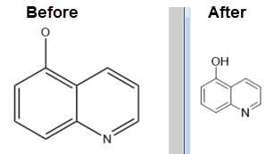
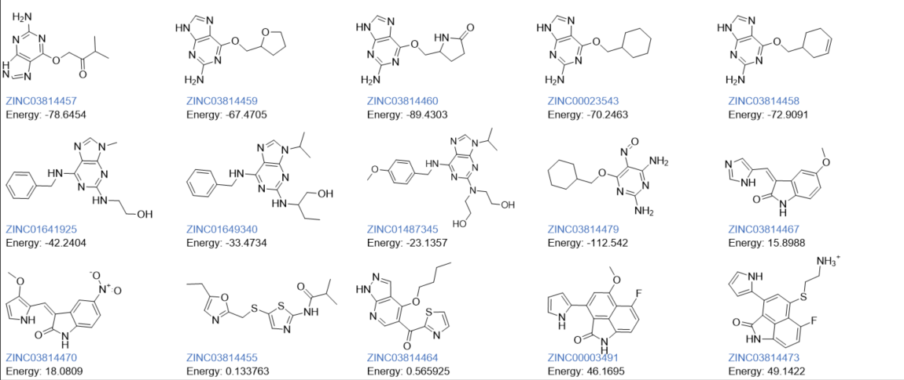

# PyCDXML

`pycdxml` package contains several modules to support working with `cdxml`and `cdx`file formats used by ChemDraw in an automated, platform-independent way. The package works without needing to have ChemDraw installed and also on non-windows systems (untested but no reason it should not work, pure python).

A hypothetical usage scenario is to convert an RDKit molecules to `cdxml`, apply the desired ChemDraw Style to all of them and generate a `cdxml`file contain them all nicely aligned. If needed this `cdxml`file can then be converted to a binary `cdx`file or base64-encoded `cdx` string. The `cdxml`or `cdx` file would then be a normal ChemDraw document that could then be opened in ChemDraw and adjusted by the end-user (chemist) to their needs.

## Installation

Due to the experimential status of the project, there is not yet an official release or stable version. The suggested approach to try it out is to create a new conda environment from an environment.yml:

```yaml
name: pycdxml
channels:  
  - conda-forge 
  - defaults   
dependencies:
  - python>=3.8  
  - rdkit>=2020.09.1 
  - numpy
  - pyyaml
  - lxml
  - fonttools
  - pip
```

```bash
conda env create -f environment.yml
```

Then clone this repository and install it in [development mode](https://packaging.python.org/tutorials/installing-packages/#installing-from-a-local-src-tree) into this new environment using pip:

```bash
python -m pip install -e c:\path\to\PyCDXML
```

If you clone the repo with git (vs downloading), this has the advantage that you can use git to pull new commits. 
You can then immediately use the new version without any further changes.

## Usage Examples

Usage example here towards the top, but I advise to still read the full document! Caveats apply!

### Format Conversions

```python
from pycdxml import cdxml_converter

# cdx to cdxml
doc = cdxml_converter.read_cdx('/path/to/structure.cdx')    
cdxml_converter.write_cdxml_file(doc, '/path/to/structure.cdxml')

#cdxml to base64 encoded cdx
doc = cdxml_converter.read_cdxml('/path/to/structure.cdxml')
b64 = cdxml_converter.to_b64_cdx(doc)

# rdkit to ChemDraw
from rdkit import Chem
suppl = Chem.SDMolSupplier('/path/to/structures.sdf')
cdxmls = []
for mol in suppl:     
    cdxml = cdxml_converter.mol_to_document(mol)
    cdxmls.append(cdxml)
```

### Applying a style

```python
from pycdxml import cdxml_styler
from pycdxml import cdxml_converter

# apply style from an existing file
# if outpath is none, input will be overwritten
styler = cdxml_styler.CDXMLStyler(style_source="/path/to/ACS 1996.cdxml")
styler.apply_style_to_file('/path/to/input.cdxml', outpath='/path/to/output.cdxml')

# apply style to document
doc = cdxml_converter.read_cdxml('/path/to/input.cdxml')
styler.apply_style_to_doc(doc)
# and now convert to base64 encoded cdx
b64 = cdxml_converter.to_b64_cdx(doc)
```
Below is a comparison of converting from one style to another. Notice that the source style hides implicit hydrogens while in the target style they are visible again.



### Slide Generator

Creates a cdxml file with an overview of the input structures and their properties nicely aligned for example for putting into a presentation. Since the output is a valid ChemDraw file, the end-user can still edit the output to his needs.

The example code shows how you can read an sd-file, convert it to cdxml and then generate a slide.

```python
import os
from rdkit import Chem
from pycdxml import cdxml_slide_generator, cdxml_converter

data_dir = os.environ["CONDA_PREFIX"] + "/Library/share/RDKit/Docs/Book/data"
cdk2_path = data_dir + "/cdk2.sdf"
suppl = Chem.SDMolSupplier(cdk2_path)
cdk2 = [x for x in suppl]

cdxmls = []
for mol in cdk2:     
    cdxml = cdxml_converter.mol_to_document(mol).to_cdxml()
    cdxmls.append(cdxml)
    
all_props = []
for mol in cdk2:
    props = [cdxml_slide_generator.TextProperty('id', mol.GetProp("id"), color='#3f6eba'), 
          cdxml_slide_generator.TextProperty('Energy', mol.GetProp("r_mmffld_Potential_Energy-OPLS_2005"), show_name=True)]
    all_props.append(props)

sg = cdxml_slide_generator.CDXMLSlideGenerator(style="ACS 1996", number_of_properties=2, columns=5, rows=3)
slide = sg.generate_slide(cdxmls, all_props)
with open("slide.cdxml", "w", encoding='UTF-8') as xf:
    xf.write(slide)
```
This will result in a cdxml file that looks like this when viewed in ChemDraw:




## Project Status

The overall status of the project can be described best as **beta**. It depends on the specific module used. Within 
the limited scope of basic small molecules, the code will likely work. But it is certain there are some unknown bugs 
and edge-cases not present in my set of test molecules.

## CDXMLConverter

`cdxml_converter`module allows you to convert between `cdxml`and `cdx` files. There is also support to convert [RDKit](https://github.com/rdkit/rdkit) molecules to `cdxml` or `cdx` files.

As of commit 9507e48 all files in the ChemDraw Samples directory can be visually correctly converted from/to cdxml. This includes correct conversion of biological shapes and sequences, images and shapes.

The conversions are based on PerkinElmers (formerly CambridgeSofts) official but very much outdated format 
specification available [here](https://www.cambridgesoft.com/services/documentation/sdk/chemdraw/cdx/IntroCDX.htm). 
Some features required "trial and error" to get working as they are either new or different from the specification. For 
more details see the README.md in the modules' directory.

major known issue: very old `cdx` files do not adhere to the official format specification and hence very often fail to be read (old means around ChemDraw 7 time-frame and older).

When converting from RDKit molecules, you will likely run into issues with organometallics, polymers or other "complex" molecules. It's best to limit usage to "single-molecule" files essentially treating the ChemDraw files like mol files. 

## CDXMLStyler

`cdxml_styler` module converts the style of the molecules contained in the `cdxml`document. The style options are limited to options that directly affect the display of the molecule like bond length, atom label size and so forth. The core usage scenario here is to convert a bunch of `cdxml`documents containing just molecule drawings to a standardized style.

The styling will often require translating the molecule. In case the document contains additional drawing elements that may or may not be related to the molecule like brackets these might not be translated at all or not entirely correctly. Also distances between molecules might change in relative and absolute terms.

If you have `cdx`files, convert them to `cdxml`with the `cdxml_converter`module, apply the style and convert back to `cdx`. That is in general the basic idea of this package. Do all manipulation in `cdxml`because due to it being `xml`it's relatively easy to do such manipulations in contrast to the binary `cdx`format.

## CDXMLSlideGenerator

`cdxml_slide_generator` module does a similar thing as my [`molecule-slide-generator`](https://github.com/kienerj/molecule-slide-generator)package but with a `cdxml`file as output. In essence the passed-in molecules and their properties are put into a single `cdxml`file nicely aligned with the properties as text below them. Properties can be anything of your choice like an activity value or simply a name or compound id. Internally `cdxml_slide_generator` makes use of `cdxml_styler` module to convert input molecules to the same style.

As additional note ChemDraw calls properties "Annotations".  The text below the molecules is just text and has no further meaning to ChemDraw. If you work inside ChemDraw and want properties to be exported into an sd-file, you need to annotate each molecule with the according values. However `cdxml_slide_generator` has you covered with this as well. All molecules are already annotated. If you save the `cdxml` file inside ChemDraw as sd-file, all the visible properties will also appear in the sd-file.

## Contribute

Please absolutely do. Just reporting issues will already help and in that case please include the affected `cdx` and `cdxml` file(s). 

### Add Tests

An important help would also be adding more and better tests. Ultimately the different modules generate new files which must somehow be validated. Currently, I'm just comparing to a reference file which itself was created by these modules but visually inspected to be correct. Issue is small changes can lead to test failures and the need to regenerate and inspect the reference files. The hence testing is not very automatic at all. 

## Miscellaneous

### License

I've used the GPLv3 because this project should be a pre-competitive community effort to make certain internal 
workflows easier to handle. The GPLv3 entirely permits you to create an internal or personal tool without needing to 
share your source code. What you can't do is add it to your commercial software and not share the full source code.
It's possible I will change this to a more permissive licence in the future.


### Chemical Intelligence

Note that this packages doesn't really contain much if any "Chemical Intelligence". Changes happen on "file level" according to file specifications and not "chemical intelligence". So there is no error detection of faulty molecules or such things.
